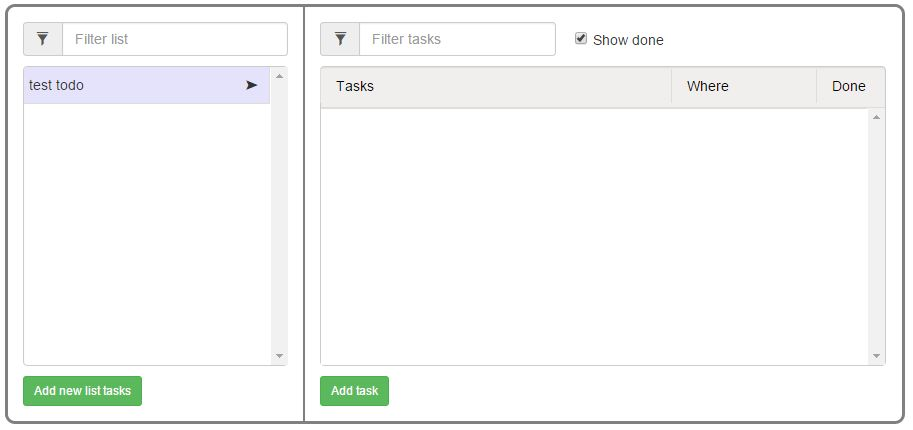

# [To-Do Task List aplication](https://todo-application-tischenko.herokuapp.com/)
https://todo-application-tischenko.herokuapp.com/

 Technologies used in application: HTML, CSS, JavaScript, jQuery, Bootstrap, Bower, handlebars.js, datetimepicker.js, moment.js. Used Model-Mediator-View software architectural pattern. Data are stored on the server in JSON format. The connection between server and client is ajax requests.

 

